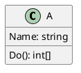

# Kysect.PlantUmlBuilder

> This is experimental prototype, API may be changed.

Kysect.PlantUmlBuilder is a Nuget library for the creation and modification of the syntax tree for the PlantUML DSL and provides functionality to generate a string-based representation of the diagram based on the constructed syntax tree.

## Sample

Code for creating PlantUML syntax tree:

```csharp
DiagramSyntaxTree tree = new DiagramSyntaxTree()
    .AddChild(
        new ClassSyntaxNode(new IdentifierSyntaxNode("A"))
            .AddChild(new TypeMethodSyntaxNode(new IdentifierSyntaxNode("Do"), new IdentifierSyntaxNode("int[]")))
            .AddChild(new TypeFieldSyntaxNode(new IdentifierSyntaxNode("Name"), new IdentifierSyntaxNode("string"))))
```

Converting this tree to string representation:



## Future development

High priority:

- Support display name for object and classes
- Support sequence diagram elements
- Support C4 elements
- Support relation type on both side - left and right: `Class19 <--* Class20`
- Support method arguments
- Support diagram name syntax node

Low priority:

- Implement Visiting method that return T
- Support public/private symbol for method
- Source generation for methods like AddChild/SetIdentifier
- Formatting Option for forcing adding '{' on new line
